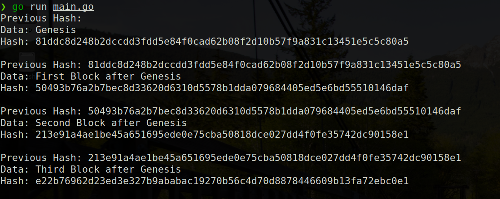

# Blockchain implementation in Go

A simple implementation of the idea behind Blockchain in [Golang](https://golang.org/) using packages like
`bytes` and `crypto` which are a part of [Golang's Standard Library](https://pkg.go.dev/std).

Example:

# Resources for Learning

## Blog

- [Build Blockchain From Scratch With Go](https://www.freecodecamp.org/news/build-a-blockchain-in-golang-from-scratch/)

- [How to build a basic blockchain in go](https://levelup.gitconnected.com/how-to-build-a-basic-blockchain-in-go-c5745ea06456)

- [Why Golang](https://medium.com/karachain/why-i-am-building-a-blockchain-in-go-6395a60b24dd)

- [Ethereum for Go Developer](https://ethereum.org/en/developers/docs/programming-languages/golang/)

## Tutorial

- [Bockchain App in Go](https://www.youtube.com/watch?v=Crw97KjIe6o)

- [Complete playlist in Golang](https://www.youtube.com/watch?v=mYlHT9bB6OE&list=PLpP5MQvVi4PGmNYGEsShrlvuE2B33xV1L)

- [Use Golang for connecting with Ethereum](https://www.youtube.com/watch?v=-7uChuO_VzM) 

# Author

<a href="https://github.com/Maharshi-Pandya">Maharshi Pandya</a>
