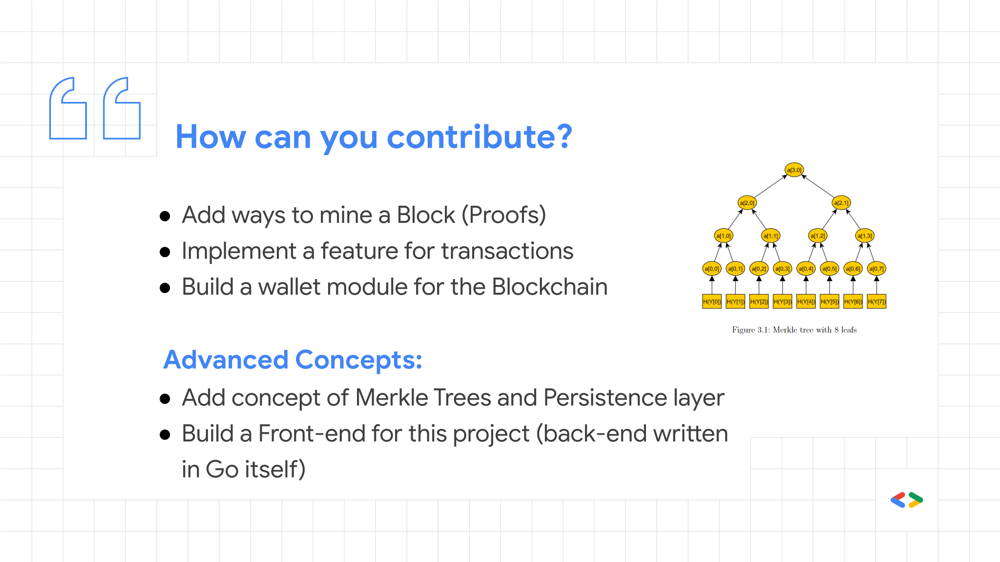

# Contributing to Blockchain-Go

Firstly, welcome aboard! :tada:

Following are the guidelines for contributing to the Blockchain-Go project, hosted on [GDSC PDEU Organisation](https://github.com/gdsc-pdeu) on GitHub. Well, these are not some rules which are to be **enforced** while contributing rather these are just the guidelines for how *can* you contribute.

## How can I contribute?

<h4>Creating Issues</h4>

Explain the problem briefly and incorporate additional details about the bug

- **Clear and Concise title** might be used to identify the bug :heavy_check_mark:
- **Steps which led to that bug** might be mentioned in as detail as possible :heavy_check_mark:
- **Screenshots or GIFs showing the problem** might be attached to clearly demonstrate and visualise the problem :heavy_check_mark:
- **What did you expect this program to perform** might as well be mentioned :heavy_check_mark:

<h4>Pull Requests</h4>

Submitting a pull request with the below style guide will be helpful for easy management of the Blockchain-Go project.

> [Tag] : Your PR title

Where, `[Tag]` can be any of these:

- :arrow_double_up: `:arrow_double_up:` (New feature)

- :bug: `:bug:` (Bug fixes)
- :memo: `:memo:` (Documentation changes)
- :art: `:art:` (Code formatting)
- :hammer: `:hammer:` (Code refactoring)

<h2>Features you can develop</h2>

Here is a non-exhaustive list of features that can be added into this project

